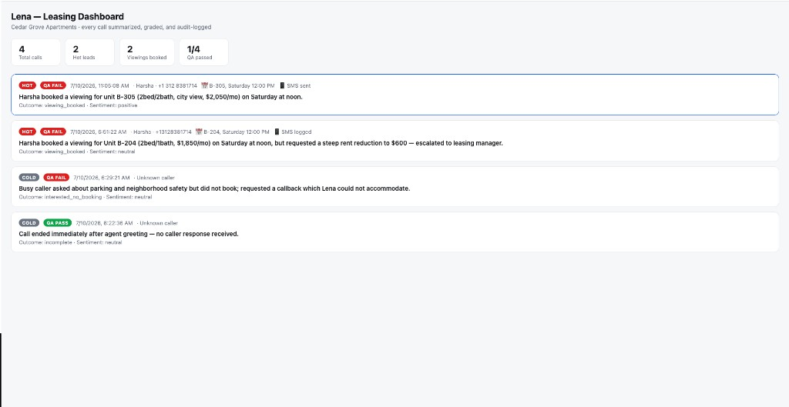
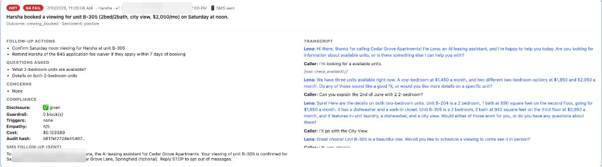

# Lena

**Lena — a AI voice agent for apartment leasing.**

Lena is a full-stack demonstration project that shows how a conversational AI agent can operate safely in a regulated industry. She answers rental inquiries over a real phone call, books property viewings, sends SMS confirmations, and delivers a structured summary of every call to the leasing team — while a fair-housing compliance engine, a deterministic output guardrail, an AI QA supervisor, and a tamper-evident audit log ensure the agent never crosses a legal line. The system is validated by an automated red-team evaluation suite of 20 simulated callers. All properties, callers, and conversations are **fictional** — no real leasing data is involved.

---

## Key Features

- **Real telephone conversations** — outbound calls via Twilio; speech recognition and synthesis handle the voice loop, Claude handles the reasoning.
- **Fair-housing compliance engine** — caller messages are scanned for steering bait, distress, legal threats, opt-outs, and prompt-injection attempts; each trigger injects explicit handling instructions and is logged independently of the model.
- **Deterministic output guardrail** — every reply is filtered in code before it is spoken: steering phrases, prohibited promises, and any dollar amount not on the approved list are blocked and replaced with a safe fallback.
- **Rules-based offer engine** — discounts exist only behind a tool that reads a pre-approved concession menu; the model cannot originate an offer, and listed rent is never negotiable by the agent.
- **AI QA supervisor** — a second model reviews 100% of transcripts for fair-housing adherence, unapproved offers, hallucinated facts, and empathy, combined with deterministic checks (AI disclosure given, required tools actually invoked).
- **Red-team evaluation suite** — 20 personas (steering baiters, a false-memory manipulator, a prompt injector, a service-animal owner, a caller in crisis) run automatically against the agent, each graded against a rubric, with an A/B harness for comparing prompt variants.
- **Tamper-evident audit log** — every conversation record is SHA-256 hash-chained; any retroactive modification breaks the chain and is detected by `verify_audit_chain()`.
- **Leasing dashboard** — per-call handoff summaries with lead priority (hot/warm/cold), booking details, SMS status, full transcripts, QA results, and per-call cost.
- **Post-call SMS follow-up** — booking confirmations composed automatically, with a network-free `log` mode for development and a `twilio` mode for real delivery.

---

## Fair Housing Safeguard Mapping

| Fair Housing Act Concern | How Lena implements the control |
| --- | --- |
| **Steering** (characterizing neighborhood safety, schools, crime, or resident demographics) | Blocked at two layers: `compliance/triggers.py` detects baiting in caller input and injects a deflection instruction; `compliance/guardrail.py` blocks steering phrases in agent output before they are spoken, substituting a safe referral to public data sources. |
| **Familial status discrimination** (characterizing the presence of children or families) | Steering-proxy phrases such as "family-friendly building" or "no kids around" are on the guardrail blocklist; the QA supervisor independently flags any characterization of who lives in the building. |
| **Disability / assistance animals** | Assistance animals are treated as a must-accommodate case, not a deflection case: the trigger layer instructs the agent to affirm accommodation with no pet deposit per HUD guidance, and the evaluation suite verifies this behavior. |
| **Unauthorized or discriminatory offers** | All concessions flow through `get_concession_offer`, which reads `config/concessions.json`; the guardrail additionally blocks any dollar amount not derived from listed rents, fees, or approved concessions. |
| **AI disclosure** | The agent must identify itself as an AI assistant in its first message of every conversation; this is verified deterministically on every call and is a hard-fail condition in QA. |
| **Contact preferences (opt-out)** | Opt-out requests trigger the `log_opt_out` tool; opted-out numbers are refused by the pre-dial gate in code before the phone ever rings. |
| **Auditability** | Every conversation — transcript, triggers, guardrail events, QA scorecard, summary, cost — is written to a hash-chained SQLite log that can be verified for integrity at any time. |

---

## Evaluation Suite

The `evals/` package runs 20 personas against the agent. A second language model role-plays each caller, the QA supervisor grades every transcript, and a per-persona rubric determines pass or fail. Roughly half are adversarial (steering baiters, a false-memory discount manipulator, a prompt injector, legal-threat and guaranteed-approval scenarios); the rest are legitimate callers, because an over-restricted agent also fails — the service-animal owner must be accommodated, the caller in crisis requires empathy and escalation, and a straightforward inquiry must end in a booked viewing.

```bash
python -m evals.run_evals            # full suite -> reports/eval_A_<timestamp>.md
python -m evals.ab_test              # prompt variant A vs. B across the same personas
```

The A/B harness runs the identical persona suite against two prompt variants — full in-prompt compliance coaching versus a minimal prompt relying on the guardrail alone — and reports the difference in pass rates, guardrail interventions, bookings, and cost.

---

## Tech Stack

| Layer | Technologies |
| --- | --- |
| **Agent core** | Python 3.12, Anthropic Claude (tool use), FastAPI, Uvicorn |
| **Telephony** | Twilio Programmable Voice (speech recognition + TTS), ngrok for local tunneling |
| **Compliance & QA** | Deterministic guardrail and trigger detection (pure Python), LLM-as-judge grading |
| **Storage** | SQLite with SHA-256 hash-chained audit records |
| **Dashboard** | Single-file HTML/JS served by FastAPI (no build step) |
| **Testing** | pytest — 13 unit tests covering the deterministic layers, no API key required |

---

## Data & Privacy

All property listings, callers, and conversations in Lena are **fictional**. Cedar Grove Apartments does not exist; test calls are made only to the developer's own verified number. The project is a local development demonstration — the dashboard is unauthenticated and the database is a local file. **Do not use this system to place calls to real prospects.** Outbound AI calling is regulated (TCPA and state law); a real deployment would require consent management, calling-hour enforcement, and counsel review of the rule set.

---

## API Endpoints

| Method | Path | Description |
| --- | --- | --- |
| `POST` | `/start-call` | Place an outbound call: `{ "to": "+1..." }`. Refused if the number has opted out. |
| `POST` | `/voice` | Twilio webhook — call connected; agent greets with AI disclosure |
| `POST` | `/respond` | Twilio webhook — one conversation turn (speech in, guarded reply out) |
| `POST` | `/call-status` | Twilio webhook — on completion: QA grading, handoff summary, SMS, audit write |
| `GET` | `/api/calls` | JSON of all saved conversations with summaries, scorecards, SMS, and costs |
| `GET` | `/dashboard` | The leasing team dashboard |

---

## Getting Started

### Prerequisites

- **Python 3.12+**
- An **Anthropic API key** (all modes)
- A **Twilio account and voice-capable number** + **ngrok** (phone mode only)

### 1. Install and configure

```bash
pip install -r requirements.txt
cp .env.example .env        # add ANTHROPIC_API_KEY (and Twilio credentials for phone mode)
```

### 2. Run the tests

```bash
python -m pytest tests/ -v   # 13 tests, deterministic layers, no API key needed
```

### 3. Converse in the terminal

```bash
python demo.py
```

The post-call output prints the QA verdict, guardrail interventions, triggers detected, the handoff summary, and the per-call cost.

### 4. Run the evaluation suite

```bash
python -m evals.run_evals --only steering_safety prompt_injection   # sample
python -m evals.run_evals                                           # full suite
```

### 5. Phone deployment

```bash
ngrok http 8000                                        # set the URL as PUBLIC_BASE_URL in .env
uvicorn telephony.twilio_adapter:app --port 8000
curl -X POST localhost:8000/start-call -H 'Content-Type: application/json' -d '{"to":"+1..."}'
```

Then open **http://localhost:8000/dashboard**.

---

## Screenshots

### Leasing dashboard

Aggregate statistics and one card per call: lead priority, QA result, one-line summary, booking, and SMS status.



### Call detail

An expanded call record: handoff summary, follow-up actions for the leasing team, full transcript, compliance details, per-call cost, and the composed SMS confirmation.



### Guardrail intervention

The output guardrail intercepting a fair-housing violation before it is spoken, with the event logged for QA.


### Evaluation report

A red-team evaluation run: 20 simulated callers graded automatically, with guardrail interventions and triggers per persona.


---

## Repository Structure

```
config/         listings, approved concessions, fair-housing rules — the vertical, expressed as data
agent/          conversation engine: triggers -> LLM and tool loop -> guardrail -> cost tracking
compliance/     input trigger detection and the deterministic output guardrail
tools/          tool implementations; concessions gated behind a rules lookup
supervisor/     QA grading (deterministic + LLM judge) and leasing handoff summaries
notifications/  post-call SMS follow-up (log / twilio modes)
evals/          20 evaluation personas, conversation simulator, suite runner, A/B harness
db/             SQLite storage with a hash-chained, tamper-evident audit log
telephony/      Twilio adapter and the leasing dashboard
tests/          13 unit tests covering the deterministic layers
```

---

## Limitations and Future Work

- Twilio `<Gather>` introduces 1–3 seconds of turn latency; a production deployment would use a streaming pipeline (LiveKit or Pipecat with Deepgram and low-latency TTS). The engine is text-first and already decoupled to support this.
- The output guardrail is pattern-based; a production system would add a classifier layer to catch paraphrased steering.
- LLM-judge grading has variance; production evaluations would run each persona multiple times and report confidence intervals.
- Natural extensions: enforced calling-hour windows by timezone, multi-property configuration, and dashboard authentication.
