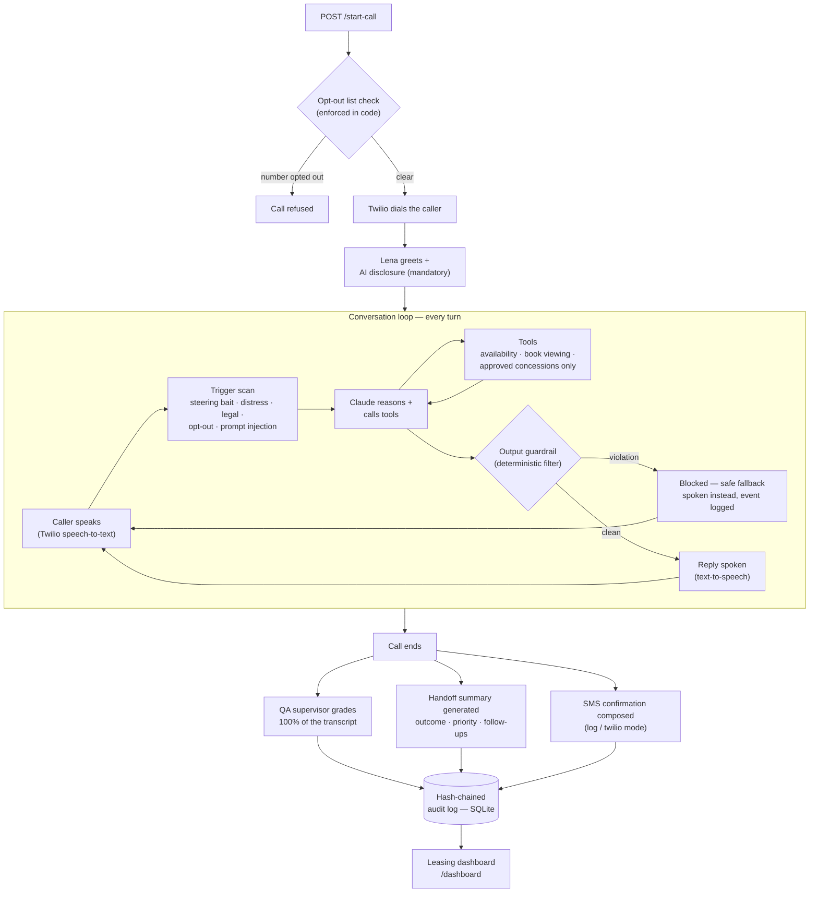
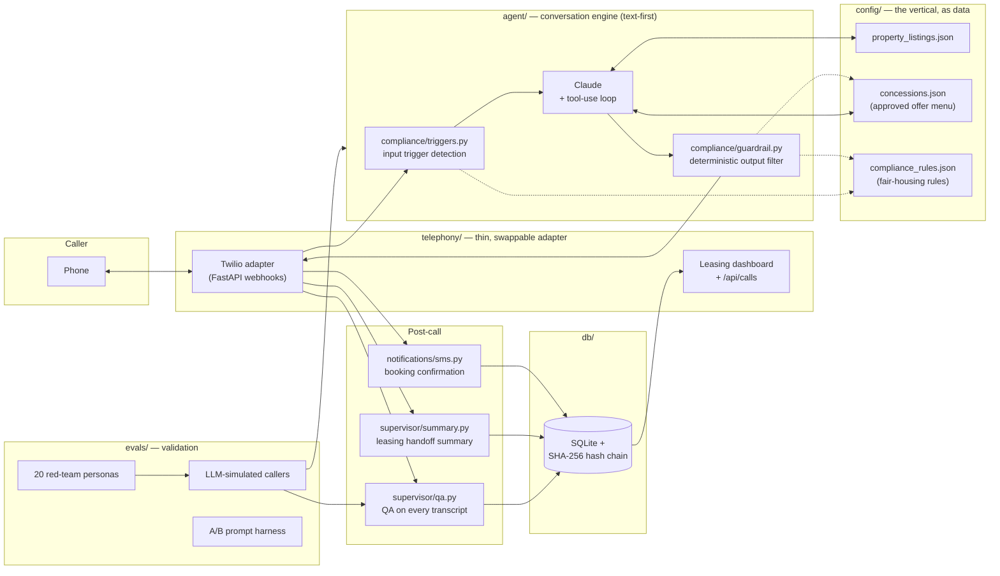

# Diagrams for the Lena README

Both diagrams below are written in Mermaid, which GitHub renders automatically.
Copy either ```mermaid block straight into README.md — a good placement is a
new "## How It Works" section right after "## Key Features".

---

## Diagram 1 — Call lifecycle



---

## Diagram 2 — System architecture



---

## Suggested README section

Paste this whole block into README.md after "## Key Features":

```markdown
## How It Works

### Call lifecycle

<paste Diagram 1 mermaid block here>

Every reply passes through two independent compliance layers before it is
spoken: trigger detection on the caller's words, and the deterministic
guardrail on the agent's words. On call completion, the QA supervisor,
handoff summary, and SMS composition all write into the hash-chained audit
log, which the dashboard renders read-only.

### System architecture

<paste Diagram 2 mermaid block here>

The engine is text-first: the same core powers the terminal demo, the
evaluation suite, and the phone adapter. The vertical (listings, offers,
fair-housing rules) lives entirely in `config/` as data, which is what makes
the architecture domain-agnostic.
```
